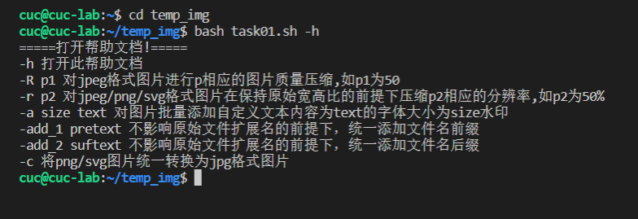
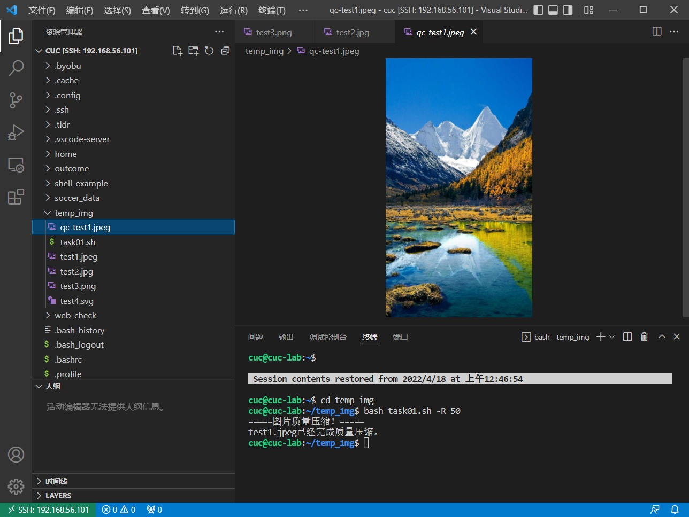
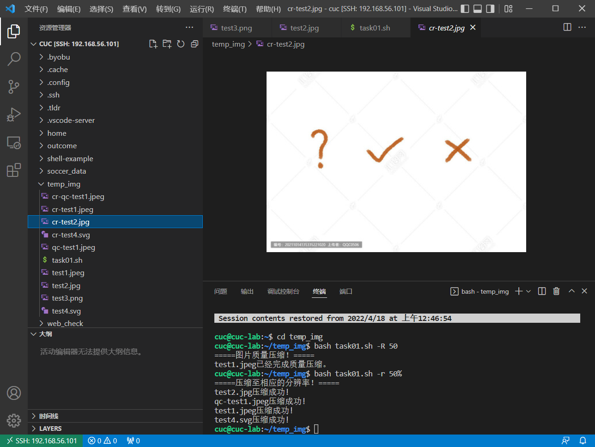
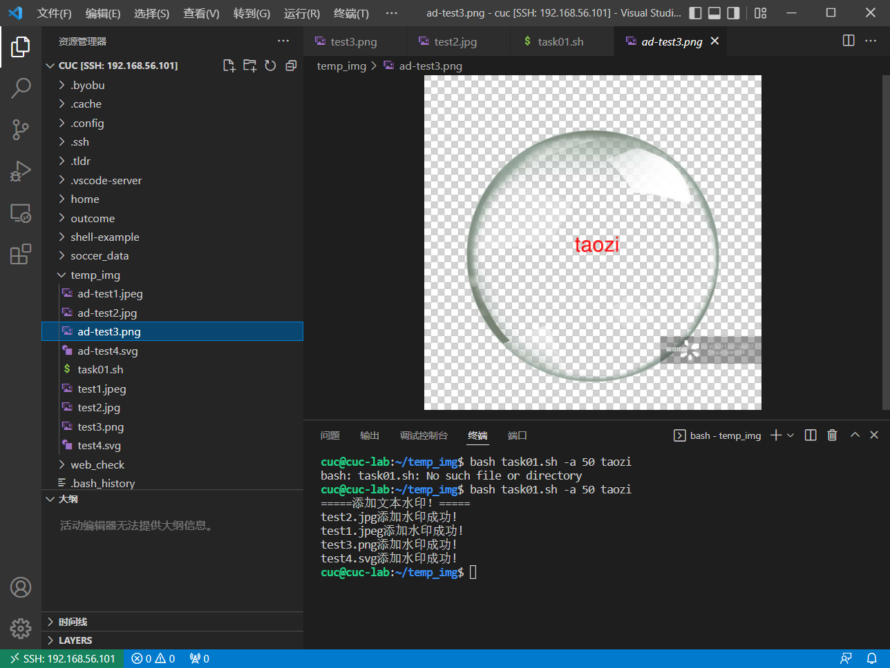
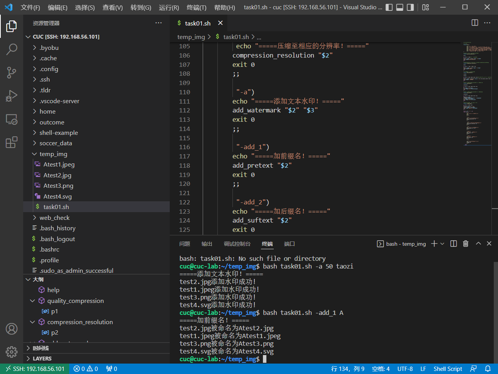
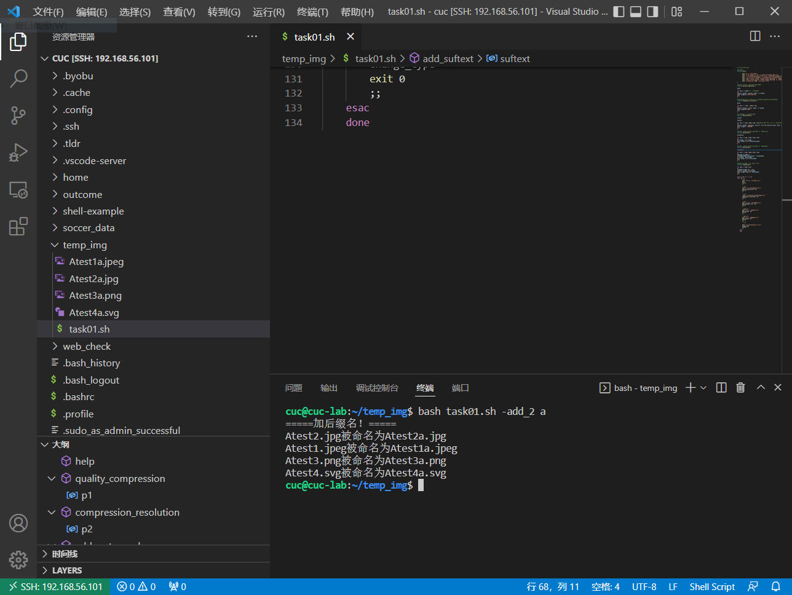
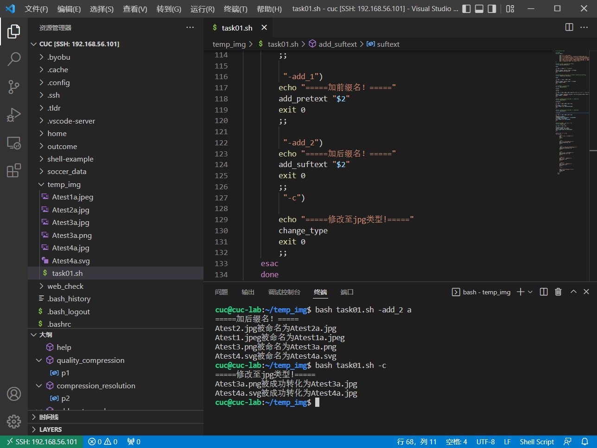
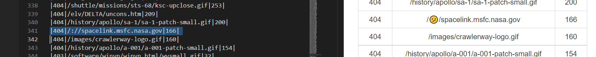
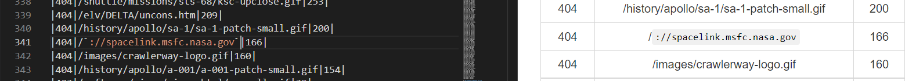

# 第四次实验作业

## 实验环境

`Ubuntu 20.04 Server 64bit`

`Vscode`

## Travis C 结果

[传送](https://github.com/CUCCS/2022-linux-public-HantaoGG/pull/4/checks?check_run_id=6062671101)

### 实验任务

#### 用bash编写一个图片批处理脚本，实现以下功能

 支持命令行参数方式使用不同功能

- [x] 支持对指定目录下所有支持格式的图片文件进行批处理指定目录进行批处理

- [x] 支持以下常见图片批处理功能的单独使用或组合使用

- [x] 支持对`jpeg`格式图片进行图片质量压缩

- [x] 支持对`jpeg/png/svg`格式图片在保持原始宽高比的前提下压缩分辨率

- [x] 支持对图片批量添加自定义文本水印

- [x] 支持批量重命名（统一添加文件名前缀或后缀，不影响原始文件扩展名）

- [x] 支持将`png/svg`图片统一转换为jpg格式

#### 用bash编写一个文本批处理脚本， 对以下附件分别进行批量处理完成相应的数据统计任务

- [x] 统计不同年龄区间范围（20岁以下、[20-30]、30岁以上）的球员数量、百分比

- [x] 统计不同场上位置的球员数量、百分比

- [x] 名字最长的球员是谁？名字最短的球员是谁？

- [x] 年龄最大的球员是谁？年龄最小的球员是谁？

#### 用bash编写一个文本批处理脚本，对以下附件分别进行批量处理完成相应的数据统计任务

- [x] 统计访问来源主机TOP 100和分别对应出现的总次数

- [x] 统计访问来源主机TOP 100 `IP`和分别对应出现的总次数

- [x] 统计最频繁被访问的`URL` TOP 100

- [x] 统计不同响应状态码的出现次数和对应百分比

- [x] 分别统计不同4XX状态码对应的TOP 10 `URL`和对应出现的总次数

- [x] 给定URL输出TOP 100访问来源主机

#### 实验要求

 继承第一章

 所有源代码文件必须单独提交并提供详细的`-help`脚本内置帮助信息

 任务二的所有统计数据结果要求写入独立实验报告

##### 任务1

 1.安装`imagemagick`

 `sudo apt-get update`
 `sudo apt-get install imagemagick`

 2.编写[task01.sh](code/task01.sh)

 3.执行效果如下：

 `echo -h`
 

 `echo -R`
 

 `echo -r 50`
 

 `echo -a 50 taozi`
 

 `echo -add_1 A`
 

 `echo -add_2 a`
 

 `echo -c`
 

##### 任务2

 编写[task02.sh](code/task02.sh)

 查看[task02最终效果](task02_result.md)

##### 任务3

 编写[task03.sh](code/task03.sh)

 查看[task03最终效果](task03_result.md)

### 实验反思

1.这次实验觉得上手的时候是比较复杂，不过当完成第一个实验的前两个任务时，发现该实验后面的任务就很类似。第二、三个实验也有类似的地方，有前面的经验后面写起来确实好了很多。

2.出现的问题如`awk`中分隔符`F`的位置，以及`BEGIN`要全部大写。整体代码和算法思路没有问题，却出现了与正确结果不同的答案。细节还是要注意好。

3.“ 统计访问来源主机TOP 100 IP和分别对应出现的总次数 ”的任务中用到了`IPv4`的正则表达式的书写，其实在这里的题目前提下，也并不是特别要求,只要匹配`x.x.x.x`就可以。我在正则表达式的在线匹配的特殊需求表达式下找到了相关的表达式：`((2(5[0-5]|[0-4]\d))|[0-1]?\d{1,2})(\.((2(5[0-5]|[0-4]\d))|[0-1]?\d{1,2})){3}`。但是这个会报错，是`awk`对`\d`的识别问题。我了解了`\d`的含义后，将其改为`[0-9]`,解决了问题。

4.将实验二、三的最终部分结果以表格形式导入时出现了问题，就是不能很简单的导入，这归咎于我的输出格式。如`printf "%-50s\t%-20s\n" "top100_host" "Count"`，这样输出出来是很好看的，但是同一行间的两个数据的间距不一样。为了成功导入表格，我复制了代码到新的脚本，将输出格式改为`printf "%s %s\n" "top100_host" "Count"`，这样间距就恒为一个空格。在`notepad 2e`里面用`replace`命令，将空格转换为`,`，再在网页的在线表格转换工具中实现表格的制作。这里特别感谢`吴杰`同学的细微指导，虽然他不一定能看到，但我写在这里感谢他的帮忙。

5.制表的时候还遇到个有趣的事情，`:/`被当做 :/ 表情符号了。能写在这里其实也说明已经解决了。放上效果图。

加上代码注释符号即可：

### 参考链接

[对`jpeg`格式图片进行图片质量压缩](https://blog.csdn.net/jiangxinyu/article/details/1698997)

[`linux` 中`awk` 指令的使用](https://www.runoob.com/linux/linux-comm-awk.html)

[正则表达式在线匹配](https://c.runoob.com/front-end/854/)

[在线表格转换](https://markdown-convert.com/en/tool/table)

